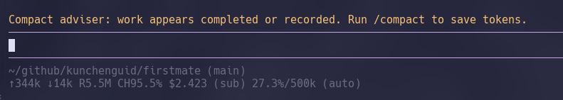
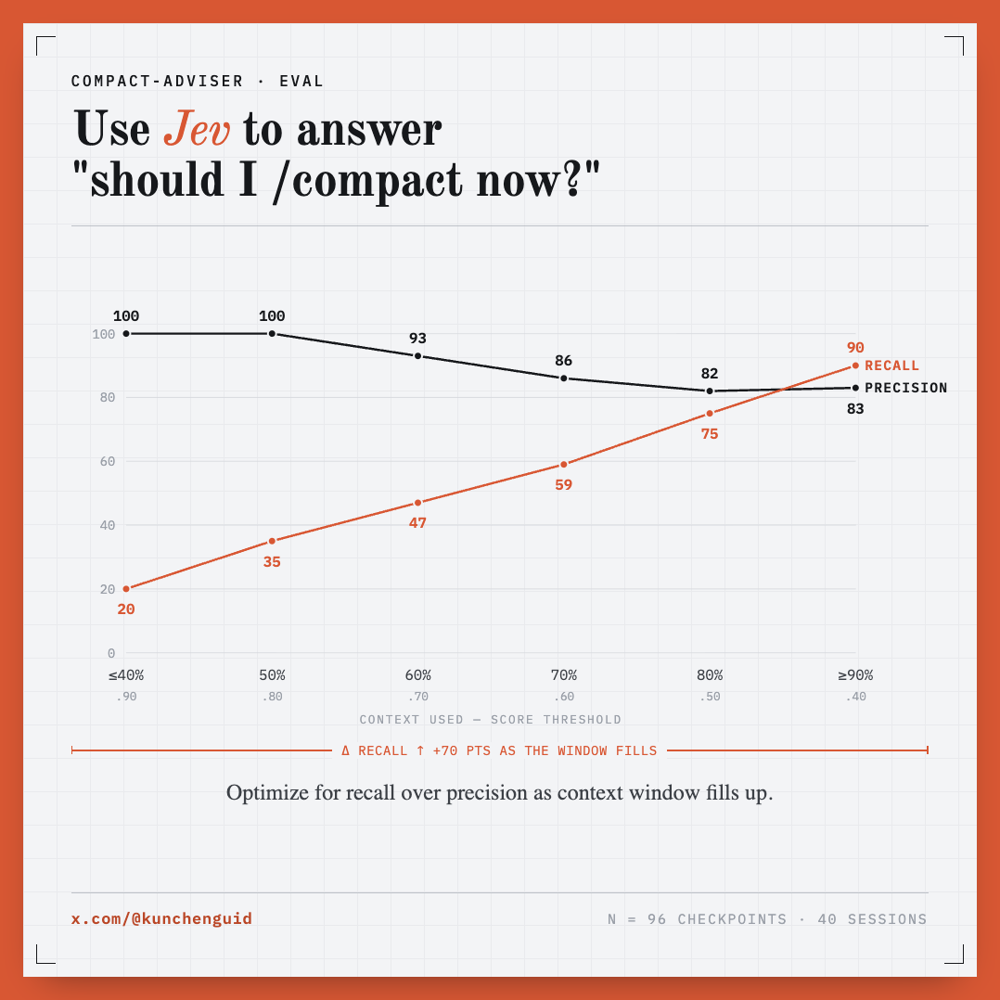

<h1 align="center">compact-adviser</h1>

<p align="center">
  <a href="LICENSE"
    ></a>
  <a
    href="https://img.shields.io/badge/platform-macOS%20%7C%20Linux-blue?style=flat-square"
    ></a>
  <a href="https://x.com/kunchenguid"
    ></a>
  <a href="https://discord.gg/Wsy2NpnZDu"
    ></a>
</p>

**compact-adviser** is an agent plugin that answers a single question: should I /compact now?



It uses [Jev](https://typesafe.ai) to instantly judge whether the current session is likely at a boundary that's safe to compact.

It can give you a hint to run `/compact` - or, on Pi and Claude Code, if you opt in, it can run it for you at the right time automatically. Codex CLI is hint-only: nothing outside a Codex session can trigger `/compact`.

Judgment is two one-sentence Jev questions in one request (is the unit finished; is this hands-on work or coordination), composed in code into one score. The hint floor is 0.90 while the context window is mostly empty (through about 10%) and relaxes toward 0.50 by about 90% full - a wrong hint costs most when there is still room. Automatic mode is the same gate, plus a first-use confirmation.

## Quick Start

Prerequisites: Node 22+ (22.18+ for Codex), and one of [Pi](https://pi.dev) 0.82.0 or newer (verified on **0.85.1**), Claude Code 2.1.274 or newer (verified on **2.1.275**), or Codex CLI 0.153.0 or newer (verified on **0.153.4**), plus a [TypeSafe API key](https://console.typesafe.ai/settings/keys). Supply it as `TYPESAFE_API_KEY` in the launch environment, enter it in `/compact-adviser`, or put it in `./.env`. Jev is TypeSafe's structured decision model; this package asks it two one-sentence classification questions and never asks it to write a summary.

Installing the package is consent to send eligible checkpoint context to TypeSafe when a key is available and the other product gates pass.

### Pi

```sh
pi install npm:compact-adviser
```

Restart Pi or run `/reload`, then `/compact-adviser`.
`/compact-adviser status` should say `Key: env`, `Key: saved`, or `Key: .env`.

To install from git: `pi install git:github.com/kunchenguid/compact-adviser` (add `-l` for project-local).

### Claude Code

This plugin uses Claude Mod which is an experimental feature that requires `CLAUDE_CODE_ENABLE_FUNCTION_HOOKS=1` in your environment.

```sh
claude plugin marketplace add kunchenguid/compact-adviser
claude plugin install compact-adviser@compact-adviser
CLAUDE_CODE_ENABLE_FUNCTION_HOOKS=1 claude
```

Then `/compact-adviser`.

### Codex CLI

```sh
codex plugin marketplace add kunchenguid/compact-adviser
codex plugin add compact-adviser@compact-adviser
```

Restart Codex and review the hook in `/hooks` once, so it is trusted. After a completed
checkpoint the advice appears as a `↳ Hook · Compact adviser: ...` line under the answer.

Codex is **hint-only**: it has no surface that lets another process run `/compact`, so there is
no automatic mode there. Settings live in a small CLI instead of a slash command; ask Codex for
"compact-adviser status" and the bundled skill runs it, or run it yourself:

```sh
node "$(ls -d "${CODEX_HOME:-$HOME/.codex}"/plugins/cache/*/compact-adviser/*/ | tail -1)src/cli.ts" status
```

## If it does nothing

| Symptom | Cause |
| --- | --- |
| `Key: missing` in `/compact-adviser status` | No `TYPESAFE_API_KEY` in the launch environment, saved settings, or `./.env` |
| No `/compact-adviser` command in Claude Code | `CLAUDE_CODE_ENABLE_FUNCTION_HOOKS` is not exactly `1` |
| Command exists, no hint | Context is below the constant 40,000-token minimum, the session is not idle, or the last turn was not a settled final answer |
| Claude Code: "nonessential traffic" | `CLAUDE_CODE_DISABLE_NONESSENTIAL_TRAFFIC` blocks plugin network requests |
| No hint in Codex | The hook is untrusted (review it in `/hooks`), Node is older than 22.18, or the hook cannot find Node at all - Codex rebuilds its PATH, so set `COMPACT_ADVISER_NODE` to an absolute `node` path |
| Pi print / RPC / JSON, Claude `-p`, or `codex exec` | The adviser stays inert in reliably detected non-interactive sessions |
| Nothing at all in Pi or Claude | `COMPACT_ADVISER_DISABLE` is set to a truthy value |

## Environment variables

| Variable | Effect |
| --- | --- |
| `TYPESAFE_API_KEY` | The Jev key, unless one is saved in `/compact-adviser` or `./.env` |
| `COMPACT_ADVISER_DISABLE` | `1`, `true`, `yes` or `on` (any case) makes the session inert: no TypeSafe request, no hint, no automatic compaction, no command. It wins over a saved `hint` or `auto` mode |
| `CLAUDE_CODE_ENABLE_FUNCTION_HOOKS` | Claude Code only; must be exactly `1` for the mod to load |
| `COMPACT_ADVISER_NODE` | Codex only; absolute path to a Node 22.18 or newer executable when the hook cannot find one on its rebuilt PATH |

Export `COMPACT_ADVISER_DISABLE=1` for unattended agent sessions, where advice has nobody to read it.

## What is sent to TypeSafe

| Included | Not sent |
| --- | --- |
| Bounded user constraints, up to the last 64 visible replies and tool results (clipped), short tool-result excerpts, an existing summary, saved-artifact names, omission markers | System prompts, hidden reasoning, images, environment variables, the API key, complete transcripts |
| Best-effort redaction of known key patterns and obvious sensitive-file results | A guarantee. Uninstall or set mode Off for material that must not leave the machine |

Requests go to `https://api.typesafe.ai/v1/systemone`, are capped at 32,000 serialized UTF-8 bytes, and never treat an error as an affirmative judgment.
Details: [SECURITY.md](SECURITY.md).

## How It Works

```
settled turn
      │
      ▼
┌───────────────────┐
│ cheap local gates │  mode, 40k minimum, idle session, key, cooldowns
└─────────┬─────────┘
          ▼
┌───────────────────┐
│ TypeSafe Jev      │  done × shape score, floor slides 0.90→0.50 with usage
└─────────┬─────────┘
          ▼
 hint: run /compact     or, with explicit auto, native compaction
```

Automatic compaction is available on Pi and Claude Code. On Codex the same judgment only ever
produces the hint, as a `↳ Hook ·` line in the scrollback.

## Usage

| Command | Effect |
| --- | --- |
| `/compact-adviser` | Settings (mode, minimum, request log, TypeSafe API key) |
| `/compact-adviser auto` / `hint` / `off` | Save that mode; auto asks for first-use confirmation (Pi and Claude Code only) |
| `/compact-adviser status` | Mode, minimum, context, key source (`env` / `saved` / `.env` / `missing`), cooldown |
| `/compact-adviser threshold 60000` | Save an absolute token minimum |
| `/compact-adviser snooze` / `dismiss` | Suppress the next three exchanges, or clear the current hint |

On Codex the same commands are arguments to the plugin's `src/cli.ts` (`status`, `hint`, `off`,
`threshold`, `log on|off`, `key set|clear|status`) rather than a slash
command, because Codex plugins cannot register a command with code behind it. Codex has no
snooze or dismiss: the CLI cannot tell which session is current.

## Eval

Local judgment eval uses real session checkpoints to score when the adviser should suggest `/compact`. The curve below is from a follow-up-aware gold set (96 checkpoints, 40 sessions): as the context window fills, the score threshold loosens from **0.90** (≤10% used) to **0.50** (≥90% used) so **recall rises** while precision stays high - favoring token savings when compaction is about to be forced anyway.



The judgment-eval harness lives in [packages/pi-extension/eval/](packages/pi-extension/eval/README.md). It is not a published dataset: point it at your own sessions and keep transcripts local.

